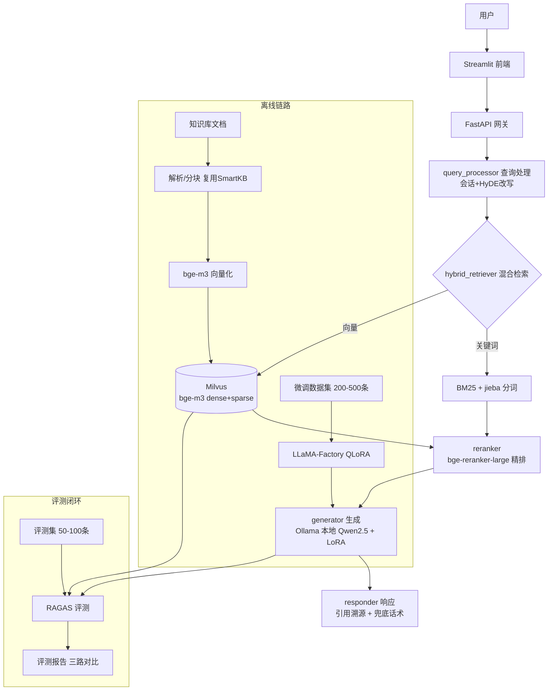

# ARCHITECTURE — SmartKB 2.0 架构与方案（阶段 1 产出）

> 用户确认后作为编码蓝图。当前未写任何业务代码（工作流 R1）。

## 目标
把 SmartKB 从"调 API 的 RAG 知识库"升级为"自部署 + 微调 + 评测驱动的企业级知识库问答系统"，一个项目覆盖大模型应用 JD 的 部署/RAG/微调/评测/容器化 全职责；AgentForge 保留为独立 Agent 项目。

## 架构图（节点 / 边 / 条件路由）


## State / 数据 Schema（管线各阶段流转结构）

| 字段 | 类型 | 说明 | 合并/流转策略 |
|---|---|---|---|
| question | str | 用户原始问题 | 入口写入 |
| session_id | str | 会话标识 | 入口写入 |
| history | list[Message] | 多轮上下文（截断策略见可靠性） | 按会话累积 |
| rewritten_query | str | HyDE/改写后查询 | query_processor 输出 |
| retrieved_chunks | list[Chunk] | 初筛结果（文本/分数/来源/检索路） | RRF 融合两路 |
| reranked_chunks | list[Chunk] | 重排后 Top-K | reranker 输出 |
| answer | str | 生成回答 | generator 输出 |
| citations | list[Source] | 引用溯源（文档名/页码/相似度） | generator 附带 |
| model_id | str | deepseek-api / qwen-base / qwen-lora | 评测对照用 |
| metrics | dict | RAGAS 指标 | evaluator 输出 |

Chunk = { text, score, source_doc, page, retriever( vector|bm25 ) }
Source = { doc_name, page, similarity }

## 节点清单

| 节点 | 输入 | 输出 | 职责 |
|---|---|---|---|
| query_processor | question, history | rewritten_query | 会话管理、HyDE 查询改写、简单意图路由 |
| hybrid_retriever | rewritten_query | retrieved_chunks | Milvus 向量召回 + BM25 关键词召回 + RRF 融合 |
| reranker | retrieved_chunks | reranked_chunks | bge-reranker-large 精排，取 Top-K |
| generator | reranked_chunks + prompt | answer + citations | Ollama 本地模型生成，强制引用溯源 |
| responder | answer + citations | API 响应 | 组装 SSE/JSON，兜底话术（"未找到相关信息"） |
| ingest（离线） | 文档 | chunks + embeddings | 解析/分块/向量化写入 Milvus |
| finetune（离线） | 数据集 | LoRA adapter | LLaMA-Factory QLoRA 训练 |
| evaluator（离线） | 评测集 + 系统 | metrics + 报告 | RAGAS 三路对比（DeepSeek API / Qwen base / Qwen+LoRA） |

## 条件路由

| 来源节点 | 条件 | 去向 |
|---|---|---|
| hybrid_retriever | 有结果且分数达标 | reranker |
| hybrid_retriever | 无结果/分数过低 | 兜底话术（responder 直出） |
| generator | 上下文超限 | 截断/压缩后重试一次（成本上限控制） |

## 技术选型与理由

| 组件 | 选择 | 理由 |
|---|---|---|
| 推理引擎 | Ollama + Qwen2.5-7B-Instruct（GGUF 量化） | 大厂 JD 高频；OpenAI 兼容 API；8GB 显存需量化 |
| 微调 | LLaMA-Factory + QLoRA（4bit） | 主流；显存友好；YAML 可复现 |
| Embedding | bge-m3（dense + sparse） | 中文强；一模型双向量 |
| 重排 | bge-reranker-large | 检索精度关键 |
| 向量库 | Milvus Lite（开发）→ Milvus standalone（生产） | 生产级；JD 高频；支持混合向量 |
| 关键词检索 | BM25（rank-bm25 + jieba 分词） | 与 SmartKB 一致；补精确匹配召回 |
| 后端 | FastAPI + uvicorn（复用 SmartKB） | 已有基础 |
| 前端 | Streamlit（复用 SmartKB） | 已有基础 |
| 评测 | RAGAS（faithfulness/answer_relevancy/context_precision/context_recall） | 行业标准；JD 要求"有自己的评估方法" |
| 部署 | Docker Compose（milvus+api+inference+frontend） | 全链路一键拉起 |
| 对照基线 | DeepSeek API（原 SmartKB 链路） | before/after 对比证据 |

## 目录结构（规划，阶段 2 起创建）
```
SmartKB2.0/
├── api/            # FastAPI 网关（复用 SmartKB 改造）
├── rag/            # 检索链路: retriever/reranker/generator/ingest
├── inference/      # Ollama 启动脚本与模型配置
├── finetune/       # LLaMA-Factory 配置与数据
├── eval/           # RAGAS 评测脚本 + EVAL_SET.md + 报告
├── frontend/       # Streamlit
├── deploy/         # docker-compose.yml 与 .env.example
├── models/         # 模型权重（不进 git）
├── data/           # 知识库文档（不进 git）
└── docs/           # NOTES/DECISIONS/ARCHITECTURE
```

## 高风险点

- [ ] 显存：8GB → QLoRA 4bit 训练 + GGUF 量化推理；OOM 时降级 3B 或减小 num_ctx
- [ ] 模型下载：国内网络 → HF 镜像(hf-mirror.com) 或 ModelScope
- [ ] Milvus 资源：开发期用 Milvus Lite（低占用、免 Docker）；生产期再用 standalone（etcd+minio）
- [ ] 中文检索：bge-m3 覆盖语义；BM25 用 jieba 分词
- [ ] 评测集质量：50-100 条真实问题覆盖高频/长尾，由用户抽查断言
- [ ] 微调数据：200-500 条 alpaca 格式；注意指令/输入/输出三字段正确性
- [ ] 训练时长：QLoRA 7B 预计 3-8 小时 → 安排夜间后台运行

